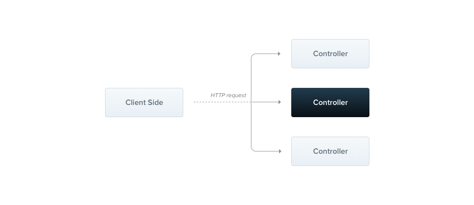
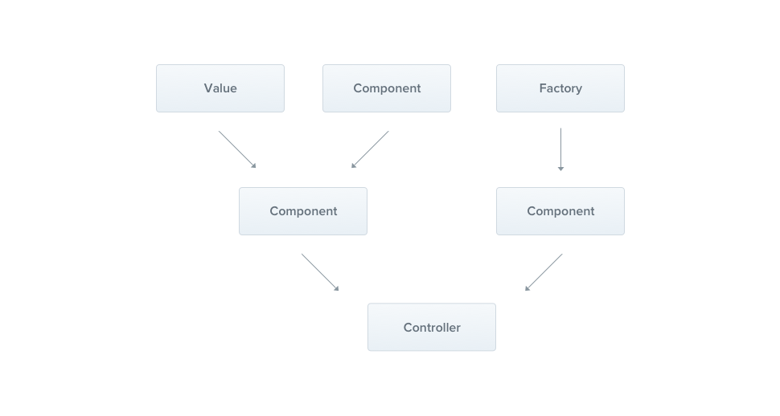
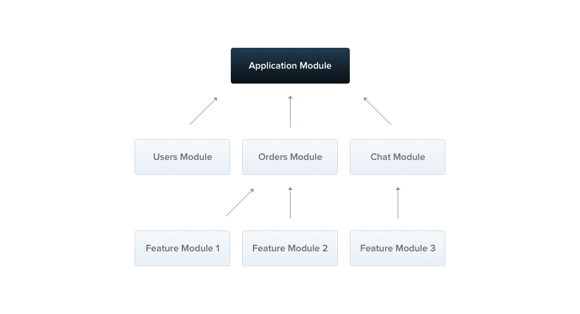
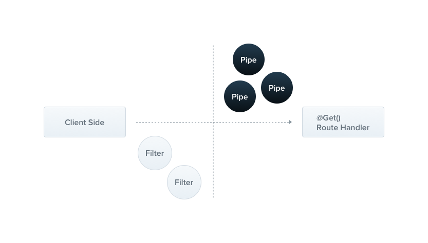

# School Management

please check the [api design](./API Design.md)

## Description

[Nest](https://github.com/nestjs/nest) framework TypeScript starter repository.

## Project Architecture

This project implements a School Management System with the following core components:

- Students
- Courses
- Lectures
- Departments
- Profiles

## NestJS Core Concepts Used in This Project

### What Are Decorators?

Decorators are a feature of TypeScript that allows you to add metadata to classes, methods, properties, and parameters. In NestJS, decorators are heavily used to define the behavior of different components. They are prefixed with `@` and placed above the code they are decorating.

### Types of Decorators in NestJS

#### 1. Class Decorators


Class decorators are applied to the class declaration and can modify or enhance the behavior of the class.

```typescript
@Controller('users')       // Marks a class as a controller for 'users' route
@Injectable()             // Marks a class as injectable (can be used as a provider)
@Module({})               // Defines a module
@Catch()                  // Creates an exception filter
@UseGuards(AuthGuard)     // Applies guards to all routes in a controller
@UseInterceptors(LoggingInterceptor) // Applies interceptors to all routes
```

Example from our project:

```typescript
@Controller('students')
export class StudentsController {
  // Controller implementation
}

@Injectable()
export class StudentsService {
  // Service implementation
}

@Module({
  imports: [ConfigModule],
  controllers: [StudentsController],
  providers: [StudentsService],
})
export class StudentsModule {}
```

#### 2. Method Decorators

Method decorators are applied to methods within a class and can modify the behavior of the method.

```typescript
@Get()                    // HTTP GET endpoint
@Post()                   // HTTP POST endpoint
@Put()                    // HTTP PUT endpoint
@Delete()                 // HTTP DELETE endpoint
@UseGuards(RoleGuard)     // Applies guard to a specific route handler
@UseInterceptors(CacheInterceptor) // Applies interceptor to a specific route
@UsePipes(ValidationPipe) // Applies pipe to a specific route
```

Example from our project:

```typescript
@Get()
findAll(@Query('search') search?: string) {
  return this.studentsService.findAll(search);
}

@Post()
create(@Body() createStudentDto: CreateStudentDto) {
  return this.studentsService.create(createStudentDto);
}
```

#### 3. Property Decorators

Property decorators are applied to class properties.

```typescript
@Inject()                 // Injects a provider into a property
@InjectRepository()       // Injects a repository (TypeORM)
@Prop()                   // Defines a property for a Mongoose schema
```

Example:

```typescript
@Injectable()
export class StudentsService {
  @Inject('CONFIG_OPTIONS')
  private readonly configOptions: ConfigOptions;
  
  // Service implementation
}
```

#### 4. Parameter Decorators

Parameter decorators are applied to parameters of a method.

```typescript
@Body()                   // Extract the request body
@Param()                  // Extract route parameters
@Query()                  // Extract query parameters
@Headers()                // Extract HTTP headers
@Req()                    // Get the request object
@Res()                    // Get the response object
@Session()                // Get the session object
@UploadedFile()           // Get an uploaded file
```

Example from our project:

```typescript
@Get(':id')
findOne(@Param('id', ParseIntPipe) id: number) {
  return this.studentsService.findOne(id);
}

@Patch(':id')
update(
  @Param('id', ParseIntPipe) id: number,
  @Body() updateStudentDto: UpdateStudentDto,
) {
  return this.studentsService.update(id, updateStudentDto);
}
```

#### Custom Decorators

NestJS allows you to create custom decorators to reuse common patterns or to create more declarative APIs.

```typescript
// Custom parameter decorator
export const User = createParamDecorator(
  (data: unknown, ctx: ExecutionContext) => {
    const request = ctx.switchToHttp().getRequest();
    return request.user;
  },
);

// Usage
@Get('profile')
getProfile(@User() user: UserEntity) {
  return user;
}
```

#### Decorator Composition

Decorators can be composed to apply multiple behaviors to a single target:

```typescript
@Controller('cats')
@UseGuards(AuthGuard, RolesGuard)
@UseInterceptors(LoggingInterceptor, TransformInterceptor)
export class CatsController {
  // ...
}
```

#### Validation Decorators

NestJS uses class-validator decorators for DTO validation:

```typescript
export class CreateStudentDto {
  @IsString()
  @IsNotEmpty()
  firstName: string;

  @MinLength(2)
  @MaxLength(50)
  lastName: string;

  @IsEmail()
  email: string;

  @IsDateString()
  birthdate: string;

  @IsOptional()
  @IsPhoneNumber()
  phoneNumber?: string;
}
```

#### How Decorators Work in NestJS

1. **Metadata Reflection**: Decorators use TypeScript's metadata reflection API to attach metadata to classes.
2. **Dependency Injection**: NestJS reads this metadata to determine how components should be instantiated and injected.
3. **Request Lifecycle**: During the request lifecycle, decorators determine how requests are processed.

#### Benefits of Using Decorators

1. **Declarative Programming**: Decorators make code more declarative and easier to understand.
2. **Separation of Concerns**: They help separate cross-cutting concerns from business logic.
3. **Reusability**: They allow for reuse of common patterns across the application.
4. **Readability**: They make code more readable by clearly expressing intent.

Understanding decorators is crucial for effective NestJS development as they form the backbone of the framework's architecture.

### 2. Controllers



Controllers are responsible for handling incoming requests and returning responses to the client. In this project, we have controllers for managing students, courses, lectures, departments, and profiles. use the `@Controller()` decorator, which is **required** to define a basic controller

Example from `students.controller.ts`:

```typescript
@Controller('students')
export class StudentsController {
  constructor(private readonly studentsService: StudentsService) {}

  @Post()
  create(@Body() createStudentDto: CreateStudentDto) {
    return this.studentsService.create(createStudentDto);
  }

  @Get()
  findAll(@Query('search') search?: string) {
    return this.studentsService.findAll(search);
  }
  
  // More endpoints...
}
```

### 3. Providers (Services)

Providers are a fundamental concept in NestJS. Many of the basic Nest classes may be treated as providers: services, repositories, factories, helpers, and so on. The main idea of a provider is that it can be injected as a dependency. 



Example from `students.service.ts`:

```typescript
@Injectable()
export class StudentsService {
  create(createStudentDto: CreateStudentDto) {
    return createStudentDto;
  }

  findAll(search?: string) {
    if (search) {
      return `This action returns all students matching the search term: ${search}`;
    }
    return `This action returns all students`;
  }
  
  // More methods...
}
```

### 3. Modules

Modules are used to organize the application structure. A module is a class that is annotated with the `@Module()` decorator Each feature module encapsulates a closely related set of capabilities.



Example from `app.module.ts`:

```typescript
@Module({
  imports: [
    ConfigModule.forRoot({
      isGlobal: true,
      envFilePath: '.env',
    }),
    CoursesModule,
    LecturesModule,
    DepartmentsModule,
    StudentsModule,
    ProfileModule,
  ],
  controllers: [],
  providers: [],
})
export class AppModule implements NestModule {
  // Middleware configuration...
}
```

### 4. Middleware

Middleware is a function which is called before the route handler. Middleware functions have access to the request and response objects, and the next() middleware function in the application's request-response cycle.


Example from `logger.middleware.ts`:

```typescript
@Injectable()
export class LoggerMiddleware implements NestMiddleware {
  use(req: Request, res: Response, next: NextFunction) {
    const startTime = Date.now();
  
    // Log request details
    console.log(
      `[${new Date().toISOString()}] ${req.method} ${req.path}`,
    );
  
    // Middleware logic...
  
    next();
  }
}
```

Middleware configuration in `app.module.ts`:

```typescript
export class AppModule implements NestModule {
  configure(consumer: MiddlewareConsumer) {
    consumer
      .apply(LoggerMiddleware)
      .forRoutes('students', 'courses', 'lectures', 'departments');
  }
}
```

### 5. Pipes



Pipes have two typical use cases:

- Transformation: transform input data to the desired form
- Validation: evaluate input data and if valid, pass it through unchanged; otherwise, throw an exception

#### Built-in pipes

Nest comes with several pipes available out-of-the-box:

* `ValidationPipe`
* `ParseIntPipe`
* `ParseFloatPipe`
* `ParseBoolPipe`
* `ParseArrayPipe`
* `ParseUUIDPipe`
* `ParseEnumPipe`
* `DefaultValuePipe`
* `ParseFilePipe`
* `ParseDatePipe`

Example global pipe in `main.ts`:

```typescript
async function bootstrap() {
  const app = await NestFactory.create(AppModule);
  app.useGlobalPipes(new ValidationPipe());
  // ...
}
```

Example parameter pipe in controller:

```typescript
@Get(':id')
findOne(@Param('id', ParseIntPipe) id: number) {
  return this.studentsService.findOne(id);
}
```

### 6. DTOs (Data Transfer Objects)

DTOs are used for data validation and type checking. They define how the data should be sent over the network.

Example from `create-student.dto.ts`:

```typescript
export class CreateStudentDto {
  @IsString()
  @IsNotEmpty()
  firstName: string;

  @IsString()
  @IsNotEmpty()
  lastName: string;

  @IsDateString()
  enrollmentDate: string;

  @IsInt()
  @IsOptional()
  departmentId?: number;

  @IsString()
  degreeProgram: string;
}
```

### 7. Configuration

Applications often run in different  **environments** . Depending on the environment, different configuration settings should be used. The application uses the `@nestjs/config` package for environment variables management. A good approach for using this technique in Nest is to create a `ConfigModule` that exposes a `ConfigService` which loads the appropriate `.env` file.

##### Installation

```
pnpm add @nestjs/config
```

```typescript
// In app.module.ts
import { Module } from '@nestjs/common';
import { ConfigModule } from '@nestjs/config';
@Module({
  imports: [
    ConfigModule.forRoot({
      isGlobal: true,
      envFilePath: '.env',
    }),
    // Other modules...
  ],
})
```

## NestJS Cheat Sheet

### Installation

```bash
# Install NestJS CLI globally
  npm install -g @nestjs/cli

# Or with yarn
  yarn global add @nestjs/cli

# Or with pnpm
  pnpm add -g @nestjs/cli
```

### Create a new NestJS application

```bash
# Create a new project
  nest new project-name

# Create a new project with specific package manager
  nest new project-name --package-manager npm
  nest new project-name --package-manager yarn
  nest new project-name --package-manager pnpm
```

### Generate components

```bash
# Generate a controller
nest g controller users

# Generate a service
nest g service users

# Generate a module
nest g module users

# Generate a resource (CRUD)
nest g resource users

# Generate a class
nest g class users/dto/create-user.dto

# Generate an interface
nest g interface users/interfaces/user.interface

# Generate a middleware
nest g middleware logger
```

### Project structure

```plaintext
src/
├── app.controller.ts      # Basic controller
├── app.module.ts          # Root module
├── app.service.ts         # Basic service
└── main.ts                # Entry point
```

### Providers and Dependency Injection

```typescript
// Service example
@Injectable()
export class UsersService {
  findAll() {
    return ['user1', 'user2'];
  }
}

// Controller using the service
@Controller('users')
export class UsersController {
  constructor(private usersService: UsersService) {}

  @Get()
  findAll() {
    return this.usersService.findAll();
  }
}
```

### HTTP Request decorators

HTTP request decorators are used to define which HTTP methods a controller route handler will respond to. Each decorator represents a specific HTTP method.

```typescript
@Get()             // Handles HTTP GET requests
@Post()            // Handles HTTP POST requests
@Put()             // Handles HTTP PUT requests (full updates)
@Delete()          // Handles HTTP DELETE requests
@Patch()           // Handles HTTP PATCH requests (partial updates)
@Options()         // Handles HTTP OPTIONS requests
@Head()            // Handles HTTP HEAD requests
@All()             // Handles all HTTP methods
```

#### Examples of HTTP Request decorators used in this project

From `students.controller.ts`:

```typescript
// POST request to create a new student
// http://localhost:3000/students
@Post()
create(@Body() createStudentDto: CreateStudentDto) {
  return this.studentsService.create(createStudentDto);
}

// GET request with optional query parameter
// http://localhost:3000/students?search=John
@Get()
findAll(@Query('search') search?: string) {
  return this.studentsService.findAll(search);
}

// GET request with URL parameter
// http://localhost:3000/students/1
@Get(':id')
findOne(@Param('id', ParseIntPipe) id: number) {
  return this.studentsService.findOne(id);
}

// PATCH request with URL parameter and request body
// http://localhost:3000/students/1
@Patch(':id')
update(
  @Param('id', ParseIntPipe) id: number,
  @Body() updateStudentDto: UpdateStudentDto,
) {
  return this.studentsService.update(id, updateStudentDto);
}

// DELETE request with URL parameter
// http://localhost:3000/students/1
@Delete(':id')
remove(@Param('id', ParseIntPipe) id: number) {
  return this.studentsService.remove(id);
}
```

#### Request Parameter decorators

NestJS provides several decorators for accessing different parts of the incoming request:

```typescript
@Req()             // Express request object
@Res()             // Express response object
@Body()            // Request body (parsed by body-parser)
@Param()           // Route parameters (e.g., /:id)
@Query()           // Query string parameters (e.g., ?search=term)
@Headers()         // HTTP headers
@Session()         // Session object (requires express-session)
@Ip()              // Client's IP address
@HostParam()       // Host parameter extracted from the HTTP Host header
```

These decorators make it easy to access specific parts of a request without having to parse the entire request object.

### Route parameters

```typescript
@Get(':id')
findOne(@Param('id') id: string) {
  return `This action returns a # {id} item`;
}
```

### Compile and run the project

```bash
# development
  pnpm run start

# watch mode
  pnpm run start:dev

# production mode
  pnpm run start:prod
```

## ENV Configuration

A good approach for using this technique in Nest is to create a `ConfigModule` that exposes a `ConfigService` which loads the appropriate `.env` file. While you may choose to write such a module yourself, for convenience Nest provides the `@nestjs/config` package out-of-the box. We'll cover this package in the current chapter.

```bash
npm i --save @nestjs/config
```

### Config app.module.ts

Typically, we'll import it into the root `AppModule` and control its behavior using the `.forRoot()` static method. During this step, environment variable key/value pairs are parsed and resolved.

`app.module.ts`

```typescript

import { Module } from '@nestjs/common';
import { ConfigModule } from '@nestjs/config';

@Module({
  imports: [
    ConfigModule.forRoot({
      isGlobal: true,
      envFilePath: '.env',
    }),
  ],
})
export class AppModule {}

```

using `main.ts` with .env

```typescript
import { ConfigService } from '@nestjs/config';

async function bootstrap() {
  const app = await NestFactory.create(AppModule);
  app.useGlobalPipes(new ValidationPipe());

  const configService = app.get(ConfigService);
  const PORT = configService.getOrThrow<number>('PORT');

  await app.listen(PORT);
}
bootstrap();
```
